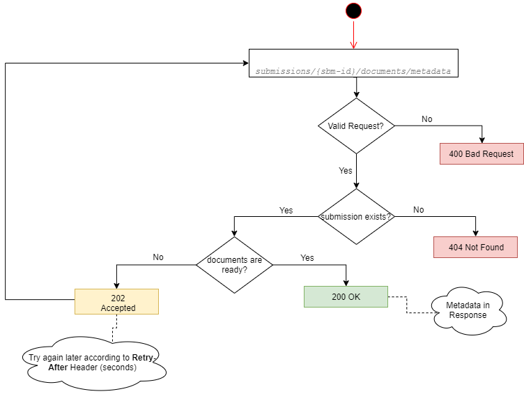
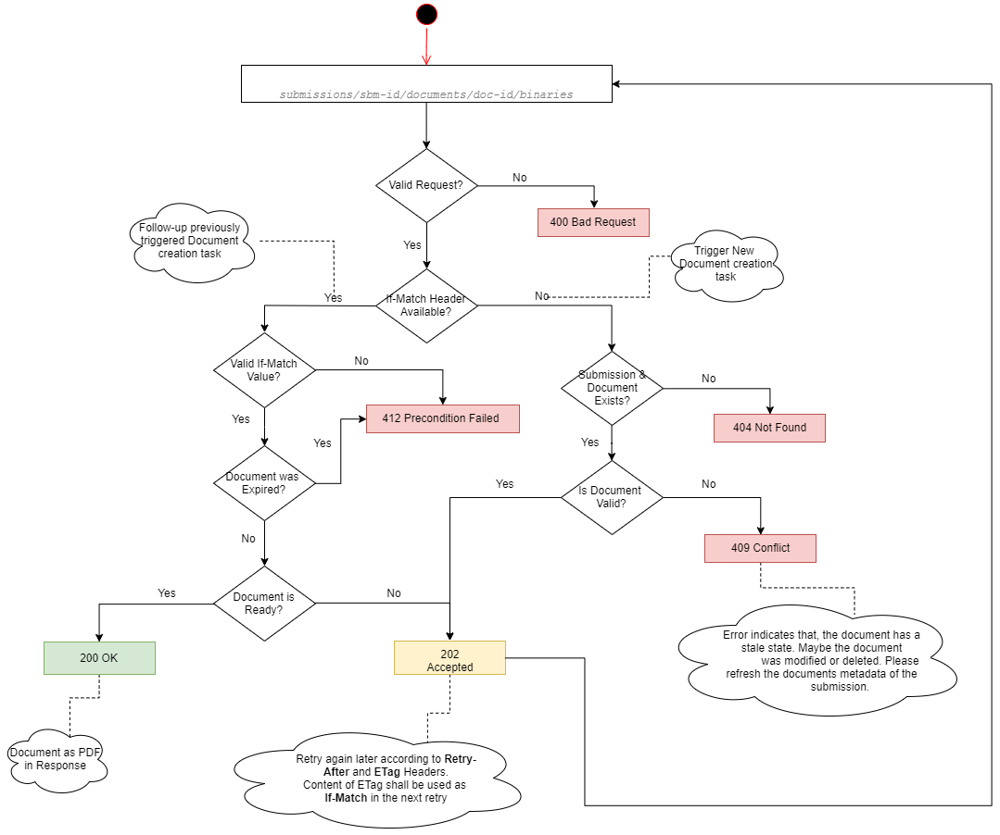

# Submission Management Service Playbook
## Abstract
This document provides needed information that enables the integration with RESTful API and resources provided by Interhyp AG.<p>
The RESTful API provides access to resources associated to submission process via *URI* paths, a client application will make an HTTP request using standard HTTP methods like *GET, PUT, PATCH, POST and DELETE* and parse the response in *JSON* format.<p>
## API Audience 
The API is intended to be consumed by clients who want to integrate Interhyp submission process in their own workflow.
## API Design Principles
During API design a set of principles were taken into consideration.
#### API First
API First is a cornerstone in our design principles, which requires two aspects:
- Define APIs first, before coding its implementation, using a standard specification language. 
- Get early review feedback from peers and client developers

By defining API outside of the code, gives un the following advantages:  
- Clear separation of *What* and *How* concerns through abstraction from implementation aspects.
- Having the client as a primary focus while creating the API.  
- Promotes better understanding of the specified domain and focus only the required functionality.
- Facilitates early client feedback.

#### Mobile First
As Interhyp promotes to Mobile First products, this affects not only the User Interface but API must also reflect this fact during design and implementation phases.

Several techniques are used in conjunction to Mobile First (but not limited to)
- Reducing bandwidth based on client needs
- Optimize network traffic
- Pagination for incremental access of larger collections of data items
- Caching
## API client
As an API client you should adhere to the following robustness principle
- Tolerant Reader; Be tolerant with unknown fields in the payload. This is required to avoid new API versions if new fields 
were added, *i.e.* ignore new fields but do not eliminate them from payload if needed for subsequent *PUT* requests
- Be prepared to handle HTTP status codes not explicitly specified in endpoint definitions.
## Version and URI
This documentation is for **version 2** of submission REST API, which is the latest version.<p>
The URIs for resources have the following structure:
```
https://<interhyp-url>/submission/v2/<resource-name> 
```  
For Example
```
https://api-test.interhyp.de/submission/v2/documents/categories
```

## Security
### Authentication
In order to grant access to the API resources, every client has to declare his identity using a `JWT` based Token.

`OAuth 2.0` is used to secure all the API endpoints, See [Authentication Concept](docs/partners_authentication.pdf) for more details.
### Authorization and Permissions
Access to the API resources is restricted to the target client, where a client may access only the resources that belong to him.
Resources belonging to a specific client are by no mean accessible by any other client with different identity. 

  

## Pagination, Expansion, and Deferred Processing
Promoting Mobile First design principle requires employing a set of concepts as described below     
### Pagination
This API uses *Cursor-based* pagination to improve performance and minimize networks traffic, Pagination is enforced for operations that potentially could return a large collection of items.
When a client makes a request to a paginated resource, the response wraps the returned array of values in a JSON object with paging metadata. For example:
```json
{
  "data": [
    "_comment: here goes the actual resource collection ..."
  ],
  "paging": {
    "cursor": {
      "before": "string",
      "after": "string"
    },
    "previous": "string",
    "next": "string",
    "first": "string",
    "last": "string",
    "self": "string"
  }
}
```
A cursor refers to a random string of characters which marks a specific item in a collection of data. <p>
The cursor will always point to the item, however it will be invalidated if the item is deleted or removed. 
> Therefore, as a client you shouldn't store cursors or assume that they will be valid in the future.

A cursor-paginated resource supports the following parameters:
* **_before_** : This is the cursor that points to the start of the page of data that has been returned.
* **_after_** : This is the cursor that points to the end of the page of data that has been returned.
* **_limit_** : This is the maximum number of objects that may be returned. A query may return fewer than the value of limit due to filtering. Do not depend on the number of results being fewer than the limit value to indicate that your query reached the end of the list of data, use the absence of `next` instead as described below.
* **_previous_** : A Hyperlink that will return the previous page of data. If not included, this is the first page of data.
* **_next_** : A Hyperlink that will return the next page of data. If not included, this is the last page of data.
* **_first_** : A Hyperlink that will return the first page of data.
* **_last_** : A Hyperlink that will return the last page of data at this point of time.
* **_self_** : A Hyperlink that will return the current page of data.
> The Absence of *next* hyperlink indicates that a query reached the end of the available result.

### Expansion
This API uses *resource expansion*, which means that some parts of a resource are not returned unless specified in the request. 
This is useful for endpoints that return large resources in order to minimizes network traffic.<p>
The expansion is controlled in two ways:
##### Query Parameter
**_embed_** query parameter controllers which information the endpoint will deliver.
> **By default:** *embed* query parameter is set to *False*, which means only basic information and a link for details and sub-resources will be returned.

Setting *embed* query parameter to *True* guide the API to deliver all details and sub-resources associated to the requested resource.
> **Tip:** Doing so will have a direct impact on the payload size and might affect response time as well. 
            
We encourage following the provided links to access each specific resource, instead of providing all sub-resources for the returned collection.<p>
**<details>
     <summary>Sample Response</summary>**
```json
{
  "data": [
    {
      "resource": {
        "href": "http://some-domain/some/link/to/somewhere",
        "embedded": {
          "resource": [
            {
              "detailed-attribute-1": "string",
              "detailed-attribute-2": "string",
              "detailed-attribute-3": "2019-11-29T18:24:49.777Z",
              "detailed-attribute-n": "string"
            }
          ]
        }
      }
    }
  ]
}
``` 
</details>

##### Header
[**_Prefer Header_**](https://tools.ietf.org/html/rfc7240) anticipates certain behaviors to be employed by a server while processing a request of clients.<p>
Currently following values are supported:
- **_return=full_** returns a full set of data which might affect the payload size.
- **_return=essential_** returns a basic set of data which provide a basic overview of the required resource.

> **_Note_** This header is considered only when query parameter `embed` is set to *True*

### Deferred Processing
Some API endpoints may trigger long-running or computationally expensive tasks. In these cases, the endpoint will schedule an asynchronous task 
in order not to block the client for the whole processing time and return an appropriate *HTTP Status Code* indicates the asynchronous processing.<p>
> **Tip:** More details will be provided in the respective endpoint.

### Headers
##### Request Headers
- Prefer
- If-Match

##### Response Headers
- ETag 
- Retry-After

## Submission Documents Management
A set of API endpoints are designed to manage relevant documents collected from the customer during Advisory/Consultation phase.<p> 
API endpoints could be divided into *two* types
- **_Structural:_** Delivers only structural information, For instance: *Document Categories*
- **_Contextual:_** Requires a specific context, for instance: information regarding a specific *Submission*

### Document Categories
Document Categories is a *Structural* endpoint which provides detailed information about possible Mortgage relevant Documents 
that could be collected from the customer and used as prove for provided information.
> **Tip:** This endpoint delivers only structural information and not bounded to a specific customer or mortgage type.
 
Every Document Category is uniquely identified via it's `name` and a set of `tags`.

**<details>
    <summary>Request</summary>**

```groovy
curl -X GET "https://some-domain/submission/v2/documents/categories" -H "accept: application/json"
```
</details>

**<details>
    <summary>Sample Response</summary>**

```json
{
  "data": [
    {
      "category": {
        "name": "KONTOAUSZUG",
        "tags": [
          {
            "name": "MIETE"
          },
          {
            "name": "MIETAUSGANG"
          }
        ]
      },
      "title": "Konto-/Depotauszug Eigenkapital"
    }
  ]
}
```
</details>

### Submission Protocol
Submission protocol is a *Contextual* endpoint which provides the client with needed information to track any changes were performed on the *submission* resource.   

> **_Tip:_** For clients that are using API `v1` to retrieve submission data, This endpoint provides the link between legacy *Submission Id* used in API `v1` and it's counterpart used in API `v2`. 

Two endpoints are available: 
- Across all submissions for a specific loan partner unit/branch.
- For a specific submission.

> **_Tip:_** `protocolType` query parameter could be used to limit the returned protocol items based on the specified type filter. If not specified, all protocol types will be returned. 

#### Across all submissions
This endpoint queries across all submissions protocol items which belongs to the specified client as identified by the `JWT` token and matching the provided criteria.

As the count of the returned protocol items depends on the provided `since` and `until` query parameters, it's possible that a large collection could be returned, therefore this endpoint will return a paginated resources.<p>
 > **_Tip:_** please refer to [Pagination](#Pagination) for more info.
 
**<details>
    <summary>Request - Minimal</summary>**
```groovy
curl -X GET "https://api-test.interhyp.de/submission/v2/submissions/protocol?since=2019-12-29T10%3A22%3A50Z" -H "accept: application/json"
```
</details>

**<details>
    <summary>Request - All optional query parameters</summary>**
```groovy
curl -X GET "https://api-test.interhyp.de/submission/v2/submissions/protocol?since=2019-12-29T10%3A22%3A50Z&until=2019-12-29T10%3A22%3A50Z&protocolType=new_submission&limit=15" -H "accept: application/json"
```
</details>

**<details>
    <summary>Response</summary>**
```json
{
  "data": [
    {
      "submission": {
        "href": "http://some-domain/some/link/to/somewhere",
        "id": "string"
      },
      "protocol": {
        "href": "http://some-domain/some/link/to/somewhere",
        "embedded": {
          "protocol": [
            {
              "type": "string",
              "id": "string",
              "createdAt": "2019-11-29T18:24:49.777Z",
              "author": "string"
            }
          ]
        }
      }
    }
  ],
  "paging": "_comment: here goes the pagination info ..."
}
```
</details>

#### Specific submission
This endpoint returns all protocol items for a specified submission. 

**<details>
    <summary>Request</summary>**
```groovy
curl -X GET "https://some-domain/submission/v2/submissions/{sbm-id}/protocol?protocolType=new_submission" -H "accept: application/json"
```
</details>

### Customer Documents
Interaction with Customer Documents can be divided into two parts:
- Metadata information
- Document Content in *PDF* format

#### Documents metadata
Document Metadata is a *Contextual* endpoint which delivers a collection of documents collected from the customer and got verified.<p> 
  
> **_Assumption:_** the above diagram assumes that the caller is already authorized to access the requested resource. 

Which information the endpoint delivers depends on the specified **_embed_** query parameter. 
> **_Tip:_** please refer to [Expansion](#Expansion) for more info.

**<details>
    <summary>Request</summary>**

```groovy
curl -X GET "https://some-domain/submission/v2/submissions/{id}/documents/metadata" -H "accept: application/json"
```
</details>

**<details>
    <summary>Request [embed set to true]</summary>**

```groovy
curl -X GET "https://some-domain/submission/v2/submissions/{id}/documents/metadata?embded=true" -H "accept: application/json"
```
</details>

**<details>
    <summary>Response [embed set to true]</summary>**

For more details regarding response structure, please refer to the *API* specification. 
```
200 OK
{
  "data": [
    {
      "id": "document-id",
      "content": {
        "href": "https://some-domain/v2/submissions/{id}/documents/{document-id}/binaries"
      },
      "category": {
        "name": "KAUFVERTRAG",
        "tags": [
          {
            "name": "ENTWURF"
          }
        ]
      },
      "reference": "An awesome straße 1, 80807 München",
      "validity": {
        "value": "01-09",
        "resolution": "MONTH"
      }
    }
  ]
}
```
```
202 Accepted
Response Headers
- Retry-After: 5 
```
</details>

#### Document content
Document content is a *Contextual* endpoint which delivers the specified customer document in `PDF` format.
> **_Tip:_** processing time for this endpoint depends on the required document, therefore a deferred processing is engaged.

 
 
 > **_Tip:_** the absence of `If-Match` Header guides the API to trigger a new deferred task to prepare the required document, in return the API will respond with an `ETag` Header.<p>
 To follow-up the created task, a subsequent requests with an `If-Match` Header contains the same value returned in the `Etag` Header are needed until the API respond with `200 OK`. 
 A `202 Accepted` response indicates that the task is not yet finished and the client needs to retry again later following the `Retry-After` Header.
 
> Every created document has a validity of *5 minutes*, after that it will be marked as expired and can't be retrieved again. In that case a new deferred task is needed. This can be achieved by eliminating the `If-Match` Header for the request. 
  
**<details>
     <summary>Request</summary>**
 ```groovy
curl -X GET "https://some-domain/submission/v2/submissions/{sbm-id}/documents/{doc-id}/binaries" -H "accept: application/pdf"
```  
</details>

**<details>
     <summary>Response 202</summary>**
 ```
202 Accepted
Response Headers
- ETag: <unique-identifier>
- Retry-After: 5
```  
</details>

 **<details>
     <summary>Request with If-Match</summary>**
 ```groovy
curl -X GET "https://some-domain/submission/v2/submissions/{sbm-id}/documents/{doc-id}/binaries" -H "If-Match: <eTag-value>" -H "accept: application/pdf"
```  
</details>

**<details>
     <summary>Response 200</summary>**
 ```
200 OK
```  
</details>