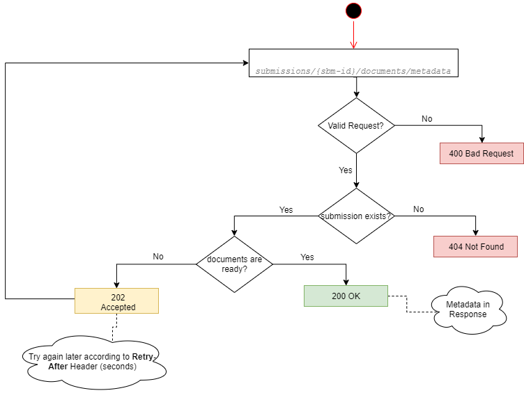
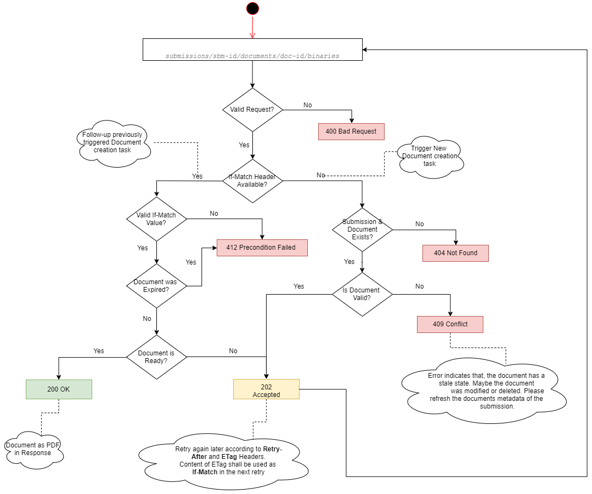

## Submission Documents Management
A set of API endpoints are designed to manage relevant documents collected from the customer during Advisory/Consultation phase.<p> 
API endpoints could be divided into *two* types
- **_Structural:_** Delivers only structural information, For instance: *Document Categories*
- **_Contextual:_** Requires a specific context, for instance: information regarding a specific *Submission*

### Document Categories
Document Categories is a *Structural* endpoint which provides detailed information about possible Mortgage relevant Documents 
that could be collected from the customer and used as prove for provided information.
> **Tip:** This endpoint delivers only structural information and not bounded to a specific customer or mortgage type.
 
Every Document Category is uniquely identified via it's `name` and a set of `tags`.

**<details>
    <summary>Request</summary>**

```groovy
curl -X GET "https://some-domain/submission/v2/documents/categories" -H "accept: application/json"
```
</details>

**<details>
    <summary>Sample Response</summary>**

```json
{
  "data": [
    {
      "category": {
        "name": "KONTOAUSZUG",
        "tags": [
          {
            "name": "MIETE"
          },
          {
            "name": "MIETAUSGANG"
          }
        ]
      },
      "title": "Konto-/Depotauszug Eigenkapital"
    }
  ]
}
```
</details>

### Submission Protocol
Submission protocol is a *Contextual* endpoint which provides the client with needed information to track any changes were performed on the *submission* resource.   

> **_Tip:_** For clients that are using API `v1` to retrieve submission data, This endpoint provides the link between legacy *Submission Id* used in API `v1` and it's counterpart used in API `v2`. 

Two endpoints are available: 
- Across all submissions for a specific loan partner unit/branch.
- For a specific submission.

> **_Tip:_** `protocolType` query parameter could be used to limit the returned protocol items based on the specified type filter. If not specified, all protocol types will be returned. 

#### Across all submissions
This endpoint queries across all submissions protocol items which belongs to the specified client as identified by the `JWT` token and matching the provided criteria.

As the count of the returned protocol items depends on the provided `since` and `until` query parameters, it's possible that a large collection could be returned, therefore this endpoint will return a paginated resources.<p>
 > **_Tip:_** please refer to [Pagination](#Pagination) for more info.
 
**<details>
    <summary>Request - Minimal</summary>**
```groovy
curl -X GET "https://api-test.interhyp.de/submission/v2/submissions/protocol?since=2019-12-29T10%3A22%3A50Z" -H "accept: application/json"
```
</details>

**<details>
    <summary>Request - All optional query parameters</summary>**
```groovy
curl -X GET "https://api-test.interhyp.de/submission/v2/submissions/protocol?since=2019-12-29T10%3A22%3A50Z&until=2019-12-29T10%3A22%3A50Z&protocolType=new_submission&limit=15" -H "accept: application/json"
```
</details>

**<details>
    <summary>Response</summary>**
```json
{
  "data": [
    {
      "submission": {
        "href": "http://some-domain/some/link/to/somewhere",
        "id": "string"
      },
      "protocol": {
        "href": "http://some-domain/some/link/to/somewhere",
        "embedded": {
          "protocol": [
            {
              "type": "string",
              "id": "string",
              "createdAt": "2019-11-29T18:24:49.777Z",
              "author": "string"
            }
          ]
        }
      }
    }
  ],
  "paging": "_comment: here goes the pagination info ..."
}
```
</details>

#### Specific submission
This endpoint returns all protocol items for a specified submission. 

**<details>
    <summary>Request</summary>**
```groovy
curl -X GET "https://some-domain/submission/v2/submissions/{sbm-id}/protocol?protocolType=new_submission" -H "accept: application/json"
```
</details>

### Customer Documents
Interaction with Customer Documents can be divided into two parts:
- Metadata information
- Document Content in *PDF* format

#### Documents metadata
Document Metadata is a *Contextual* endpoint which delivers a collection of documents collected from the customer and got verified.<p> 
  
> **_Assumption:_** the above diagram assumes that the caller is already authorized to access the requested resource. 

Which information the endpoint delivers depends on the specified **_embed_** query parameter. 
> **_Tip:_** please refer to [Expansion](#Expansion) for more info.

**<details>
    <summary>Request</summary>**

```groovy
curl -X GET "https://some-domain/submission/v2/submissions/{id}/documents/metadata" -H "accept: application/json"
```
</details>

**<details>
    <summary>Request [embed set to true]</summary>**

```groovy
curl -X GET "https://some-domain/submission/v2/submissions/{id}/documents/metadata?embded=true" -H "accept: application/json"
```
</details>

**<details>
    <summary>Response [embed set to true]</summary>**

For more details regarding response structure, please refer to the *API* specification. 
```
200 OK
{
  "data": [
    {
      "id": "document-id",
      "content": {
        "href": "https://some-domain/v2/submissions/{id}/documents/{document-id}/binaries"
      },
      "category": {
        "name": "KAUFVERTRAG",
        "tags": [
          {
            "name": "ENTWURF"
          }
        ]
      },
      "reference": "An awesome straße 1, 80807 München",
      "validity": {
        "value": "01-09",
        "resolution": "MONTH"
      }
    }
  ]
}
```
```
202 Accepted
Response Headers
- Retry-After: 5 
```
</details>

#### Document content
Document content is a *Contextual* endpoint which delivers the specified customer document in `PDF` format.
> **_Tip:_** processing time for this endpoint depends on the required document, therefore a deferred processing is engaged.

 
 
 > **_Tip:_** the absence of `If-Match` Header guides the API to trigger a new deferred task to prepare the required document, in return the API will respond with an `ETag` Header.<p>
 To follow-up the created task, a subsequent requests with an `If-Match` Header contains the same value returned in the `Etag` Header are needed until the API respond with `200 OK`. 
 A `202 Accepted` response indicates that the task is not yet finished and the client needs to retry again later following the `Retry-After` Header.
 
> Every created document has a validity of *5 minutes*, after that it will be marked as expired and can't be retrieved again. In that case a new deferred task is needed. This can be achieved by eliminating the `If-Match` Header for the request. 
  
**<details>
     <summary>Request</summary>**
 ```groovy
curl -X GET "https://some-domain/submission/v2/submissions/{sbm-id}/documents/{doc-id}/binaries" -H "accept: application/pdf"
```  
</details>

**<details>
     <summary>Response 202</summary>**
 ```
202 Accepted
Response Headers
- ETag: <unique-identifier>
- Retry-After: 5
```  
</details>

 **<details>
     <summary>Request with If-Match</summary>**
 ```groovy
curl -X GET "https://some-domain/submission/v2/submissions/{sbm-id}/documents/{doc-id}/binaries" -H "If-Match: <eTag-value>" -H "accept: application/pdf"
```  
</details>

**<details>
     <summary>Response 200</summary>**
 ```
200 OK
```  
</details>